# ⚖️ 案件推演台

* 脚本编写、教程作者：Gloria
* 本作品发布在Discord社区：旅程、尾巴镇、喵喵电波
* 脚本若有问题，可以随时在社区问我
* 最新版本：V1.1.1
* 更新时间：2026/04/30
* 获取方式：社区获取 / github获取
* json：脚本全部版本
* cot：当前脚本大纲适配的案件推进cot（大概？）
---

# 📑 目录

* [🗝️ 功能简介](#-功能简介)
* [🚀 安装与使用教程](#-安装与使用教程)
* [🧠 生成器与提示词解析](#-生成器与提示词解析)
* [❓ 常见问题](#-常见问题)
* [📝 更新日志](#-更新日志)
* [🧭 全系列导航](#-全系列导航)——同系列前后两作，三件套配合使用效果更佳


---

# 🗝️ 功能简介

首先，这是一个帮助推理剧情推进的工具，并不能写剧情，而是从案件设计的角度出发，生成完整的案件流程（注意，不是破案流程）。

**用于：**
* 推理案件跑团
* 侦探剧情RP
* 本格 / 社会派 / 硬核 / 反转等风格的案件设计
* 多案关联 / 系列作 / 跨案元谜题
* 快穿 / 多世界切换中的单元案件

**生成内容包括但不限于：**
* 案件世界观（时代 / 地域 / 社会层级）
* 人物图谱（受害者 / 嫌疑人 / 证人）
* 双轨时间线（表象 vs 真实）
* 线索库 + 核心突破线索链
* 真相还原 + 多结局框架
* 嵌套模式下的跨案人物 / 物证 / 时间轴 / 元谜题

针对AI模型不会埋伏笔、线索会漏、真相会崩的问题，这个生成器的作用是：
**提前构建"案件逻辑骨架"**
让模型：
* 有动机-手法-机会三锁可遵循
* 有线索链可推导
* 有真相可收束
* 有反转可埋但不提前触发

**核心玩法：**
* 包含可扩展提示词系统+可编辑生成器
* 支持自动生成 + 世界书注入
* 预设系统支持保存多项配置 / 导出 JSON / 导入他人预设
* 人物库跨案复用，可为角色卡定制推理风格 / 构建个人案件库

---

# 🚀 安装与使用教程

---

## 1 安装脚本
* 非常正常的导入操作：
* 下载 JSON 文件
* 打开酒馆助手
* 导入脚本
<p align="center">
  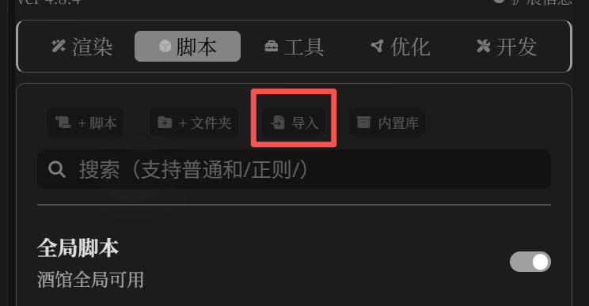
</p>
启用：「魔法棒 → 案件推演台」
<p align="center">
  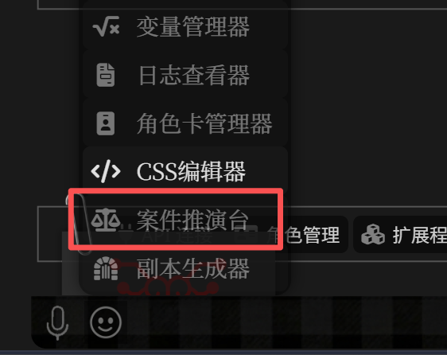
</p>

---

## 2 前期配置

### 五种主题
* 分别是**港风 / 报纸 / 法医 / 勘察 / 黑板**，每个主题都有对应的视觉小彩（巧）蛋（思）
<p align="center">
  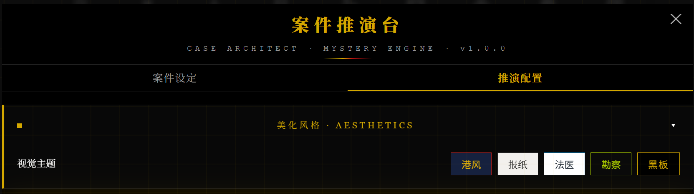
</p>

### API配置
* （直接偷副本生成器的图了）
* 很基础的配置方法，API URL / API Key / Model，不多赘述
<p align="center">
  
</p>

### 提示词设置
* 支持修改和保存预设，如果对自己的推理风格有特殊要求可以在这里修改（可以参照下面的详细介绍）
* 默认 Prompt 已优化，新手建议完全不改直接用
<p align="center">
  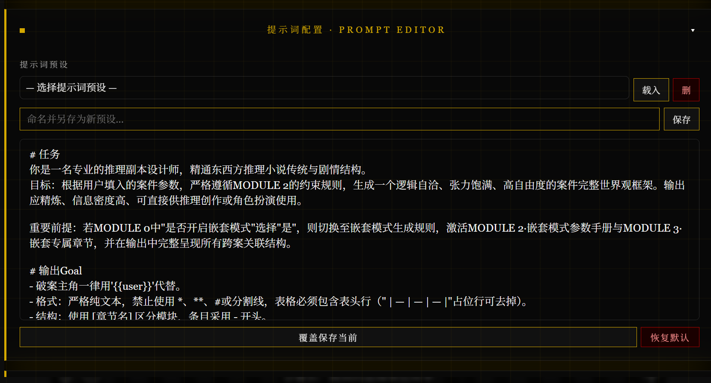
</p>

---

## 3 生成器配置

### 基础载入
* 该部分支持界面（按钮）编辑，如果不需要可以直接选择（可多选，如果不想选就点随机或不选）
默认参数组包括：
* **案件风格**：解谜 / 社会 / 脑洞 / 明牌 / 硬核 / 职场 / 辩驳 / 反转 / 考据 / 港台 / 现实（多选）
* **复杂程度**：简单 / 中等 / 复杂 / 极复杂 / 随机
* **基调**：悲剧 / 中性 / 温情 / 黑暗 / 随机
* **时代**：现代 / 民国 / 古代 / 战乱 / 未来 / 随机
* **地域**：内陆 / 港台 / 日本 / 欧美 / 随机
* **社会层级**：底层 / 中产 / 上流 / 混层 / 随机
* **破案人员构成**：单人 / 搭档 / 多人 / 对立调查 / 随机
* **{{user}}是否在嫌疑范围**：不在 / 在 / 随机
* **案件类型**：谋杀 / 密室 / 失踪 / 连环 / 阴谋 / 随机

下面讲一下自定义版面的方法，点击"编辑"进入编辑界面
<p align="center">
  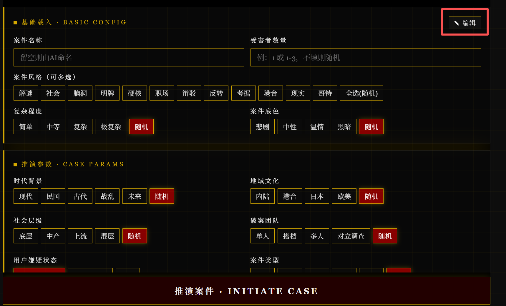
</p>

* 进入后可以删除 / 添加按钮
* 如果想要添加一个按钮，直接选择后面的"自定义即可"
* 添加多个按钮和解释，点击批量导入，一行是一个按钮

<p align="center">
  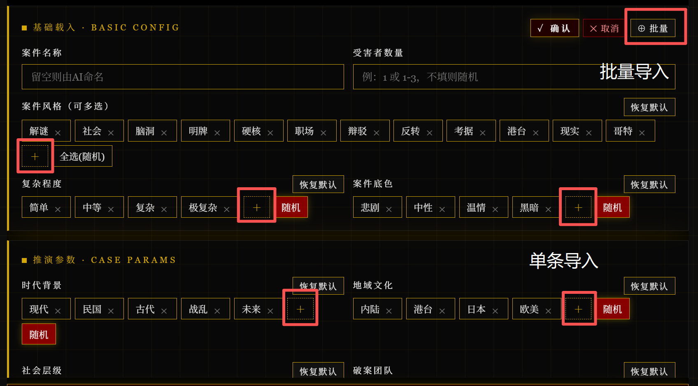
</p>

* 全部弄完点击"确认"即可
* **该编辑部分可以保存在预设，支持导入和导出**

### 背景挂载

* 这里可以在“设置”里上传你的全部角色库，然后回到这里配置角色
* **人物库**：跨案复用的角色档案池，{{user}}和NPC共用同一库
* 每个人物档案包含：姓名 / 角色定位 / 描述
* 玩法：把你角色卡里的{{user}}侦探、常驻搭档、反复出场的NPC都丢进来，案件间人物就是连贯的
<p align="center">
  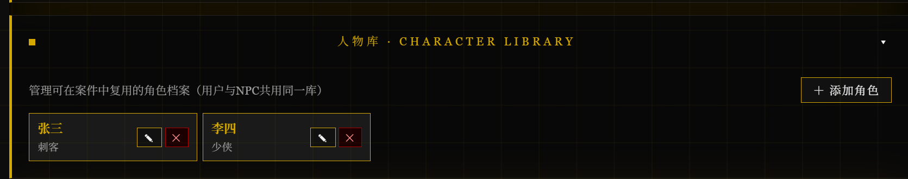
</p>

**注入配置**：
* **读取已有世界观**：选择“是”，自动加载当前角色卡下世界书条目，可选择世界观对应条目
* **用户设定描述**：{{user}}的设定，可从人物库选择，输入身份（此部分说明是破案的/受害者/凶手等）
* **NPC信息描述**：和你世界观有关的NPC设定，从人物库选择，输入身份（此部分说明是破案的/受害者/凶手等）
* **注入最后一层聊天内容**：注入最后一层的聊天记录
* **输出语言**：如果你不想被剧透，选择“加密”，导入世界书的大纲是你看不懂的西语
* 玩法：跑剧情跑到某个案件发生，用推演台开启此条目，可以让生成的案件大纲贴合当前剧情

### 嵌套模式（重要）
* 这是案件推演台相对副本生成器的**核心新增能力**：把多个案件关联成系列（连环案件）。
* 启用位置：生成器面板 → "嵌套模式"开关
* 开启后需要**从世界书载入既有案件大纲**作为嵌套上下文（也可以手动粘贴），AI会基于这些既有案件生成新案件，并产出跨案关联结构。
* 嵌套模式激活后，生成内容会额外包含 **MODULE 4 嵌套专属章节**：
**写作建议**：第一次玩先不开嵌套，把单案跑熟再开，不然信息密度会爆炸。
<p align="center">
  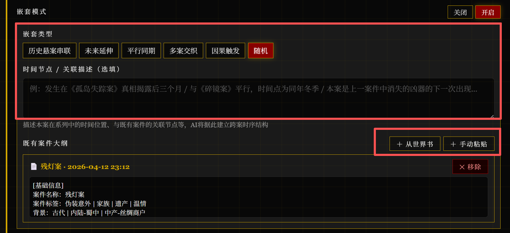
</p>

**以上内容均选择完，点击“推演案件”**

---

### 4 生成案件
* 点击"生成案件"（或"开始推演"），弹出确认界面，展示信息和tokens
* 如果你想检查你想要的部分是否全部导入，点击红色部分
<p align="center">
  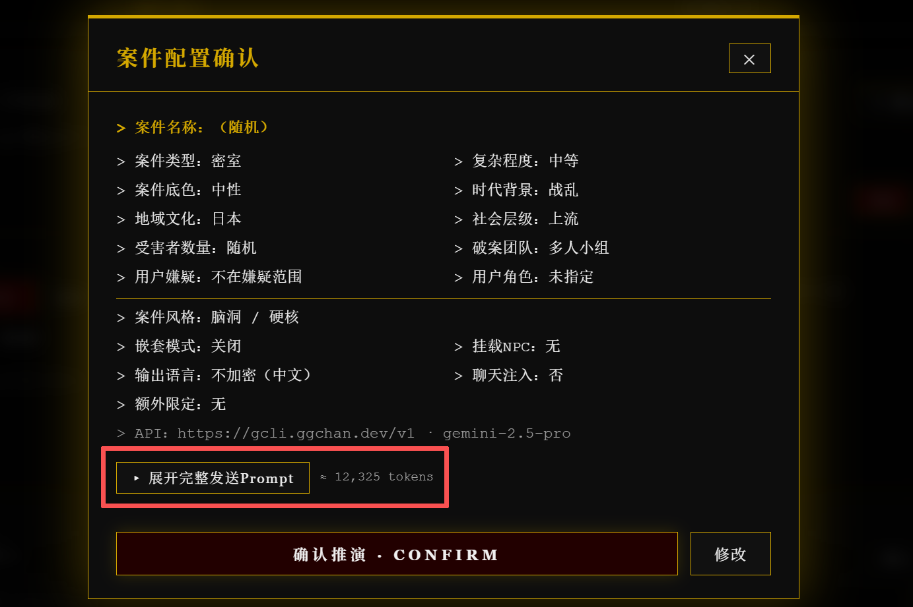
</p>

* 模型加载成功界面如下，注意，简要信息一定是中文（与加密无关）且不会剧透
生成逻辑是：
* `<case>`：完整案件大纲（含人物图谱 / 双轨时间线 / 线索库 / 真相还原 / 嵌套专属章节）
* `<case_info>`：摘要（案件名称 / 风格 / 复杂度 / 涉案人数 / 核心谜面 / 嵌套状态 / 关联案件）
* 所以，如果生成失败，可能是模型不听话，包裹错了部分，可以选择重新roll，或者看一下全部内容，如果没问题也可以导入（因为摘要不会导入世界书，无伤大雅）
* 想要看全部内容，点击红色部分
<p align="center">
  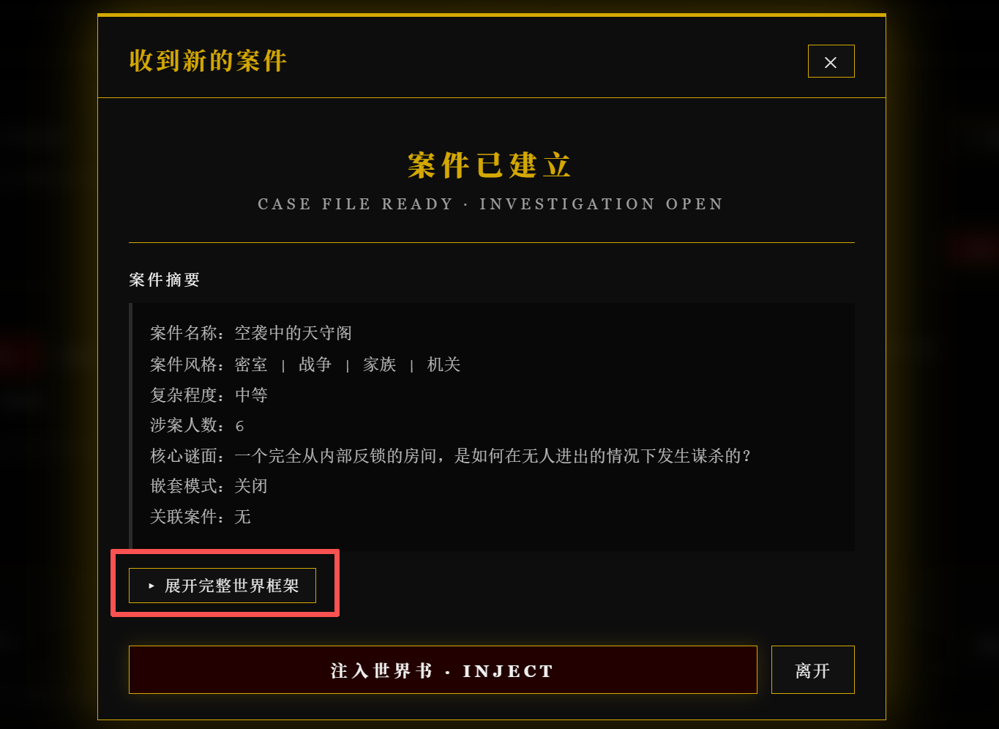
</p>

* 如果你对生成的内容还算满意，点击"注入世界书"，自动创建一个新的世界书并注入（第一次，之后都在这个世界书里）
* 世界书名 **_我的破案之路**
* 案件大纲以"**案件名 · 时间**"归档，支持多案累积
* 显示下面条目说明导入成功，可以打开世界书查看
<p align="center">
  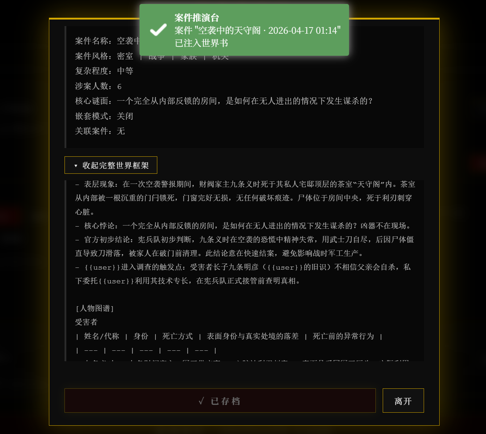
</p>

* 目前写了一个简单的包裹条目（【前】案件内容开始 / 【后】案件内容结束）用于前后包裹并做了防剧透，条目和层数都可以自行更改
* 世界书使用的时候请手动挂载，跑完案件需要自行关闭，每次把案件导入世界书都会默认开启
<p align="center">
  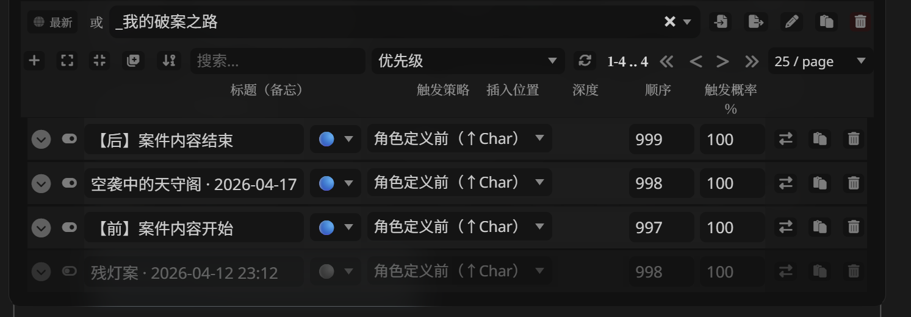
</p>

**接下来请放心大胆的进入推理案件的世界吧，别被凶手骗了**

---

## 6 预设导入 / 导出
* 在"核心设置"最下面，很好理解，选择需要的条目导入即可
* 导入的时候做了防覆盖，所以可以放心大胆的导入
* 这个功能是给想要备份 / 分享自己做的面板准备的，希望可以看到更多的好模板~
* 支持的预设类型：生成器配置预设 / 提示词预设

---

# 🧠 生成器与提示词解析

---
* 接下来属于进阶版教程，如果你想要修改提示词 / 生成器配置，请看这里了解整体逻辑。
* 首先，提示词当中包含对于生成器词条的描述，并且生成器的内容会影响输出大纲的案件复杂度 / 风格 / 时代等。
* **总结：**
强相关的部分（建议一起联动修改）：
```
MODULE 0（也就是生成器配置）
MODULE 1（将配置和模板内容关联）
MODULE 2（嵌套模式参数手册，嵌套开启时才激活）
MODULE 3（模板内容）
```
下面是详细介绍：
---

## Prompt 架构总览

整个生成器的 Prompt 被拆成 6 个模块（注意：本脚本比副本生成器多了嵌套模式和MODULE 4）：

```
MODULE 0：参数注入（你填的配置）
MODULE 1：参考框架库（风格系谱 / 时代地域 / 案件类型库）
MODULE 2：嵌套模式参数手册（仅嵌套开启时激活）
MODULE 3：主体框架生成指令（单案必出）
MODULE 4：嵌套专属章节（仅嵌套开启时生成）
MODULE 5：输出约束（<case> / <case_info> 包裹规则）
```

---

## MODULE 0 · 参数输入（不要改！）

这是生成器 UI 的内容注入位置：

```
{{MODULE_0_BLOCK}}
```
包含：
* 案件风格 / 复杂度 / 涉案人数
* 时代 / 地域 / 社会层级 / 基调
* 破案人员构成 / {{user}}是否在嫌疑范围
* 案件类型
* 是否开启嵌套模式 + 嵌套类型 + 载入的既有案件
* 人物库信息 / 聊天记录注入

**因为这里是全部输入内容，你不需要修改这里**

---

## MODULE 1 · 参考框架库（可调整）

这一块是**整个生成器的"推理世界观素材库"**

包含：
* **推理风格系谱**：11种风格及其代表作家 / 核心美学 / 生成侧重
* **完美案件生成规则**：动机-手法-机会三锁 / 层叠真相 / 误导设计 / 凶手人性化 / 公平性原则
* **时代 × 地域表**：线索载体 / 调查权限 / 动机压力容器
* **社会层级表**：动机类型 / 可调动资源 / 隐瞒成本 / 张力来源
* **案件类型库**：空间诡计 / 时间诡计 / 身份诡计 / 伪装类 / 毒物类 … 每类下还有手法变体

该部分和“案件设定”的按钮还有输出案件框架强相关，可以按照自己的喜好修改：
可以按照喜好修改：
* 想要新的推理风格 → 改**推理风格系谱**
* 想要新的时代背景→ 改**时代 × 地域表**
* 想要新的案件类型→ 改**案件类型库**

---

## MODULE 2 · 嵌套模式参数手册（最复杂的部分）

**仅当生成器中"嵌套模式 = 是"时激活**

此模块定义了五种嵌套类型每一种的：
* 时序形态
* 跨案连接关键词
* 人物跨案状态
* 物证流转形态
* 特征词

以及**元谜题设计规则**：
* 元谜题必须是各单案真相拼合后才能提出的问题
* 答案不得与任何单案结论矛盾，只能在单案基础上增加深度
* 需设计独立解锁条件（须注明需要哪几个案件的哪几条线索同时在场）
* 若系列未完结，元谜题可处于"可见但未解"状态

### 修改建议
* 此部分和MODULE 4输出结构强绑定，改MODULE 2的定义需要同步改MODULE 4的表格列。
* **建议不改，开始直接用默认定义跑几个系列再说。**
* （但是目前此功能还在测试阶段，实际嵌套效果如何全看模型聪不聪明）

---

## MODULE 3 · 主体框架生成指令（看到的大纲）

输出内容包含：
```
[基础信息]
[案件谜面]
[人物图谱]（受害者 / 嫌疑人列表 / 关键证人）
[双轨时间线]（表象 vs 真实）
[线索库]（实物 / 证言 / 文件）
[核心突破线索链]（强制表格）
[可用于反转的关键节点]
[真相还原]（凶手 / 动机 / 手法 / 共谋 / 漏洞 / 结局框架）
[开场钩子]
```

### 关键设计点
* **动机-手法-机会三锁**：凶手必须同时满足三者，且三者均需通过线索可推导
* **双轨时间线**：两条时间线的分叉点即案件核心手法所在
* **核心突破线索链**：强制表格，每条链由前文线索构成，推理结论须能独立支撑真相某一维度
* **真相解锁条件**：最低解锁（可指控）/ 完整解锁（无法抵赖）双阶段，防止AI过早露底
* **反转点设计**：不会触发，只会埋点

### 修改建议
* 此部分是核心内容，修改会影响整体输出，并且和MODULE 1的内容强相关，谨慎修改
* 建议不要删掉核心结构，仅修改"写作参考"微调即可
* **但是希望可以看到更好的模板！**

---

## MODULE 4 · 嵌套专属章节（仅嵌套模式开启时生成）

输出结构：
```
[跨案人物注册表]
[跨案物证流转链]
[跨案因果结构]
[跨案时间轴整合]
[元谜题框架]（可选）
```

每个表格都有严格的列定义和写作速查，比如：
* 跨案物证流转链的"合并解读后的第三层意义"必须产生单案不可见的新信息
* 跨案时间轴整合的"合并视野"一列不得仅重复两案已知内容
* 元谜题问题须是伦理 / 存在 / 身份层面的深层疑问，不能仅是另一个技术性手法谜题

### 修改建议
和MODULE 2联动修改。如果你重新定义了嵌套类型，MODULE 4的表格结构也要对齐。

---

## MODULE 5 输出约束（别乱改！）

这里非常重要：
```
<case> ... </case>
<case_info> ... </case_info>
```
* 脚本会解析这两个标签为：案件正文 / 简要信息
* 除非你想修改"案件简要信息"的输出，可以修改此部分内容

---

# ❓ 常见问题

### Q1：推荐用什么模型？
* gemini 2.5 pro / 3.1 pro（最推荐，最稳定，嵌套模式也扛得住）
* gemini 3 flash（勉勉强强）
* 没试过别的

### Q2：没有按钮 / 有按钮打不开？
* 请在社区给我看报错，最好用电脑端，F12开发者模式给我看报错（error）
* 不过本人代码能力也是一坨，可以尝试先问ai

### Q3：嵌套模式需要开前序案件吗？
* 因为有嵌套章节，如果有大总结测试下来可以不开前序案件
* 当然开了肯定会更好，如果token不爆炸的话

---

# 📝 更新日志

## v1.1.1
* 新增：世界书条目修正模式，支持选择已有条目并生成修正版内容
* 新增：生成结果页重新生成按钮，复用上次配置与提示词再次生成

## v1.0.1
- 新增：大总结功能，支持AI智能全文大总结

## v1.0.0
* 首个发布版本
* 支持单案生成 + 嵌套模式（5种嵌套类型）
* 人物库跨案复用
* 世界书自动归档（_我的破案之路）

---

# 🧭 全系列导航

* 目前已完成了较为完整的三部曲制作——从最初想要做一个副本大纲生成器，到呼声比较高的案件生成，最后完成了自由度最高的番外生成。
* 在此感谢大家的帮助和支持，如果喜欢当前作品，欢迎看看其他两个小工具：

---

## 💀 无限流·副本生成器

> 从副本设计师的角度出发，生成有关副本的设计大纲，帮助 AI 在恐怖 / 无限流 / 跑团场景中有规则可遵循、有机制可推进、有真相可收束。

🔗 [gloria-yin/DUNGEON\_ARCHITECT](https://github.com/gloria-yin/DUNGEON_ARCHITECT)

**用于：** 恐怖故事 / 无限流跑团 / 副本任务设计 / 大世界嵌套副本 / 快穿多世界切换

**生成内容：** 世界结构 / 规则系统 / 信息不对称设计 / 反转与张力埋点

---

## 🌙 番外织梦阁·SPINOFF WEAVER

> 自由度最高的番外剧本生成器，从平行时空到深度机制碰撞，搭建完整舞台供你自由 RP，并支持跨番外联动的连载级番外宇宙。

🔗 [gloria-yin/SPINOF\_WEAVER](https://github.com/gloria-yin/SPINOF_WEAVER)

**用于：** 平行时空 RP / 特殊机制碰撞 / 穿越快穿支线 / 连载级番外宇宙

**生成内容：** 情境快照 / 动态事件池 / 多维走向框架 / 任务系统 / 跨番外联动继承结构

---

# ⭐ 最后

希望哈基米能看懂我的大纲。祝破案顺利，别被凶手骗了。
如果你也在玩推理RP，欢迎一起交流~
